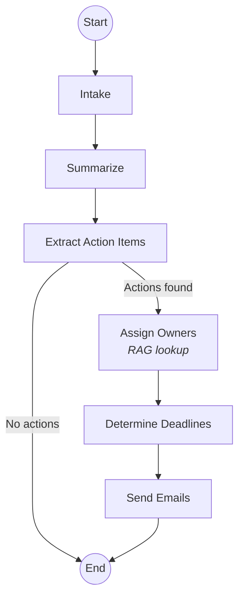

# Huddle AI

A terminal-based agentic application that processes meeting transcripts and extracts actionable intelligence using LangGraph, LangChain, and LangSmith.

## Table of Contents

- [Features](#features)
- [Demo](#demo)
- [LangSmith Trace](#langsmith-trace)
- [Architecture](#architecture)
- [Quick Start](#quick-start)
- [Project Structure](#project-structure)
- [Usage](#usage)
- [Development](#development)
- [Design Notes](#design-notes)
- [What I'd Improve With More Time](#what-id-improve-with-more-time)
- [Technologies](#technologies)

## Features

- **Meeting Processing**: Transform chaotic meeting discussions into structured action items
- **Automatic Assignee Detection**: RAG-powered team member matching based on expertise
- **Deadline Extraction**: Intelligent parsing and inference of due dates
- **Email Notifications**: Simulated email sending to action item owners
- **Interactive Assistant**: RAG-powered chat for team and meeting queries
- **Full Observability**: LangSmith integration for tracing and evaluation

## Demo


## LangSmith Trace
Peek into traces of one end-to-end transcription by Huddle AI:

https://smith.langchain.com/public/0b975f5a-3c20-400c-a0b3-2c0ebbd2a6c6/r
## Architecture

The app has two modes:
- **processing pipeline** that turns transcripts into action items
- **RAG-powered assistant** for ad-hoc questions about your team and past meetings.

```
Main Menu
├─ 1. Process Meeting Transcript
│  ├─ 1. Use Sample Transcript (navigable list)
│  └─ 2. Paste Transcript (with preview)
│
└─ 2. Assistant (RAG-powered chat)
   ├─ General questions → Direct LLM
   ├─ Team queries → Team Directory RAG
   └─ Meeting queries → Meeting History RAG
```

### LangGraph State Machine



Each node is a pure function that receives the current `MeetingState` (a TypedDict) and returns a partial update. LangGraph merges the updates into state automatically so no manual wiring needed. The only branching point is after extraction: if no action items are found, we skip straight to the end and return the summary alone.

## Quick Start

### Prerequisites

- Python 3.11+
- OpenAI API key
- LangSmith API key (for tracing)

### Setup

1. **Clone the repository**
   ```bash
   git clone https://github.com/Amishk599/huddle-ai
   cd huddle-ai
   ```

2. **Create and activate virtual environment**
   ```bash
   make setup
   source venv/bin/activate
   ```

3. **Install dependencies**
   ```bash
   make install
   ```

4. **Configure environment**
   ```bash
   cp .env.example .env
   # Edit .env with your API keys
   ```

5. **Initialize vector stores**
   ```bash
   make init-stores
   ```

6. **Run the application**
   ```bash
   make run
   ```

## Project Structure

```
huddle-ai/
├── src/
│   ├── main.py          # Application entry point
│   ├── agent.py         # LangGraph state machine
│   ├── tools.py         # LangChain tools (email sender)
│   ├── rag.py           # Vector store setup and retrieval
│   ├── prompts.py       # Prompt templates
│   ├── models.py        # Pydantic models
│   ├── config.py        # Application configuration
│   ├── ui/              # Terminal UI components
│   │   ├── menus.py     # Main menu and navigation
│   │   ├── processing.py # Progress display
│   │   ├── results.py   # Results formatting
│   │   └── assistant.py # Chat interface
│   └── assistant/       # RAG-powered assistant
│       └── chain.py     # Question routing and chains
│
├── data/
│   ├── team_directory.json      # Team member data for RAG
│   ├── sample_transcripts/      # Example meeting transcripts
│   └── vector_stores/           # Chroma databases
│
├── evals/
│   ├── run_evals.py     # Evaluation runner
│   └── eval_dataset.json # Test cases
│
├── scripts/
│   ├── setup_vector_stores.py   # Initialize Chroma stores
│   └── generate_demo_traces.py  # Create demo traces
│
└── docs/
    ├── architecture.md  # Design decisions
    └── langsmith-guide.md # LangSmith setup
```

## Usage

### Process a Meeting Transcript

1. Run `make run`
2. Select "1. Process Meeting Transcript"
3. Choose a sample transcript or paste your own
4. Watch the processing pipeline execute
5. View extracted action items with assignees and deadlines

### Use the Assistant

1. Run `make run`
2. Select "2. Assistant"
3. Ask questions about:
   - Team members: "Who has Python expertise?"
   - Past meetings: "What was discussed with Todd?"
   - General topics: "What is LangGraph?"

## Development

### Run Evaluations
```bash
make eval
```

### Clean Up
```bash
make clean
```

## Design Notes

### Why LangGraph over a simple chain?

- A meeting transcript pipeline naturally has a branching point: sometimes there simply aren’t any action items. When that happens, half the pipeline doesn’t need to run.

- In a simple chain, handling that cleanly usually means stacking if/else checks and conditional logic throughout the flow. It works, but it gets messy fast.

- LangGraph makes this straightforward. You define a single routing function, add conditional edges, and the graph takes care of the rest. No spaghetti logic.

- On top of that, you get node-level tracing in LangSmith out of the box, so every step is individually visible and easy to debug.

### Dual RAG strategy

Two separate vector stores instead of one:

- **Team Directory**: indexed on role, expertise, and current projects. Used during processing to match action items to the right person.
- **Meeting History**: indexed on full transcript text. Used by the assistant to answer questions about past discussions.

Keeping them separate means retrieval stays focused: a query like "who knows Python?" doesn't pull in meeting notes, and "what did Todd say?" doesn't return team bios.

### Structured output everywhere

Every LLM call uses Pydantic models via `with_structured_output()`. This means we get validated, typed data at each graph node so no regex parsing, no string splitting, no "hope the LLM formats it right." If the model returns something that doesn't match the schema, it fails loudly instead of silently corrupting downstream state.

### Mock email system

Emails write to `emails_sent/` as plain text files. This is intentional as it gives a clear audit trail for demos, makes testing deterministic, and avoids needing external service credentials. Swapping to SendGrid/SES later would be a single function change in `src/tools.py`.

## What I'd Improve With More Time

- **Real email/Slack integration**: replace the file-based mock with SendGrid or a Slack webhook, so action items actually reach people.
- **PII redaction**: scrub emails, phone numbers, and names before storing transcripts in the vector store.
- **Hybrid search**: combine semantic similarity with keyword matching (BM25) for better RAG recall, especially for names and acronyms.
- **Streaming LLM output**: the assistant already streams, but the processing pipeline could show partial results as they generate.
- **Confidence scores on assignments**: surface the RAG similarity score so users can see when the system is guessing vs. confident about an assignee match.
- **Export formats**: JSON/CSV export for action items, plus Jira/Linear integration for teams that live in those tools.
- **Eval depth**: more test cases, particularly adversarial ones (transcripts with no clear owners, ambiguous deadlines, multiple languages).

## Technologies

- **LangGraph** - State machine orchestration
- **LangChain** - LLM calls, RAG, tools
- **LangSmith** - Tracing and evaluations
- **OpenAI** - gpt-4o-mini
- **FAISS** - Vector store
- **Rich** - Terminal UI
- **Prompt Toolkit** - Interactive menus
- **Pydantic** - Structured outputs

## License

MIT
